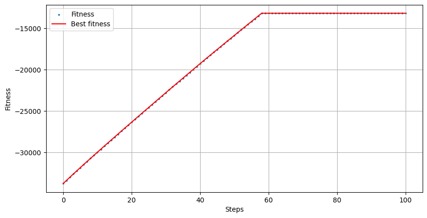
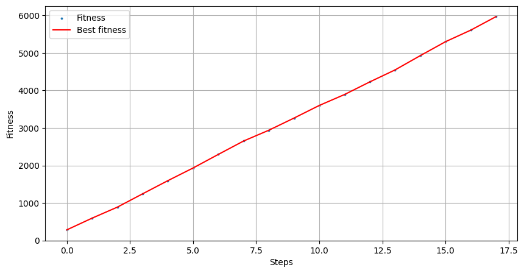
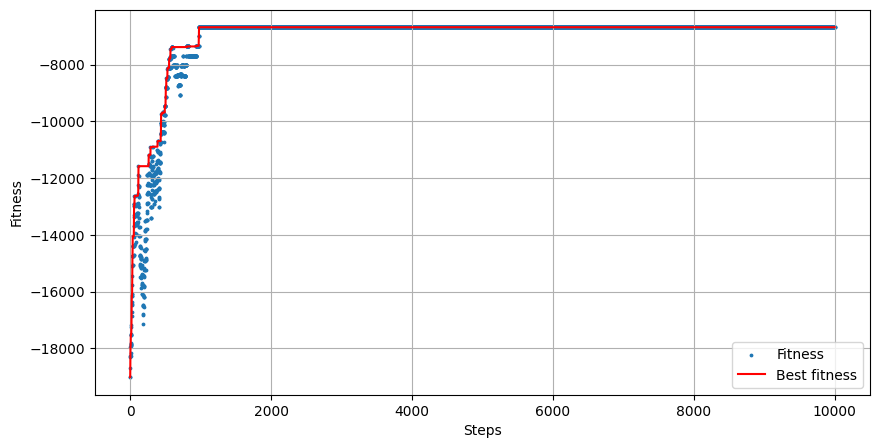

# Set Cover Problem

The Jupyter Notebook presents a comparison between three algorithms developed to solve the Set Cover Problem.
Each algorithm's performance has been evaluated across different instances based on execution time and the quality of the solution (fitness value).
A higher fitness value (closer to zero) indicates a better solution, as it represents a lower cost to cover all items in the universe.

The following table summarizes the execution results:

| Instance | Universe Size | Num Sets | Density | Execution Time Solution 1 | Best Fitness Solution 1 | Execution Time Solution 2 | Best Fitness Solution 2 | Execution Time Solution 3 | Best Fitness Solution 3        |
|----------|---------------|----------|---------|---------------------------|-------------------------|---------------------------|-------------------------|---------------------------|--------------------------------|
| 1        | 100           | 10       | 0.2     | 240ms                     | -271.544                | 210ms                     | -271.544                | 595ms                     | -136.55 (**invalid solution**) |
| 2        | 1,000         | 100      | 0.2     | 405ms                     | -13193.718              | 183ms                     | -5967.996               | 615ms                     | -6678.618                      |
| 3        | 10,000        | 1,000    | 0.2     | 2.513s                    | -175425.567             | 253ms                     | -101371.377             | 1.224s                    | -133464.135                    |
| 4        | 100,000       | 10,000   | 0.1     | 45m 32s                   | -2566839.346            | 21.577s                   | -1525514.078            | 13m 28s                   | -47044103.225                  |
| 5        | 100,000       | 10,000   | 0.2     | 47m 45s                   | -2796323.840            | 13.416s                   | -1715952.2693           | 18m 43s                   | -98889589.561                  |
| 6        | 100,000       | 10,000   | 0.3     | 50m 20s                   | -2813886.565            | 8.322s                    | -1760075.686            | 15m 3s                    | -153822327.883                 |

## Result comparison

- **Solution 1 (Cost-Removal)**: This algorithm is slower for larger instances but tends to yield reasonably good solutions with higher fitness values. However, it becomes computationally expensive as the problem size increases.

- **Solution 2 (Greedy Algorithm)**: The fastest algorithm, that also yelds the best fitness between all the 3 algorithms for all problem instances. 
  It performs well in terms of both speed and solution quality.

- **Solution 3 (Simulated Annealing)**: This approach is faster than solution 1 but slower than solution 2, and gives a solution quality that is worse than solution 1 and 2.
  Also, when we have a lower number of sets it can generate invalid solutions, as observed in instance 1.

## Plots

The following plots show the fitness values of the exploited solutions (blue dots) and the fitness of the best solution found by each algorithm for instance 2.

#### Solution 1

#### Solution 2

#### Solution 3

